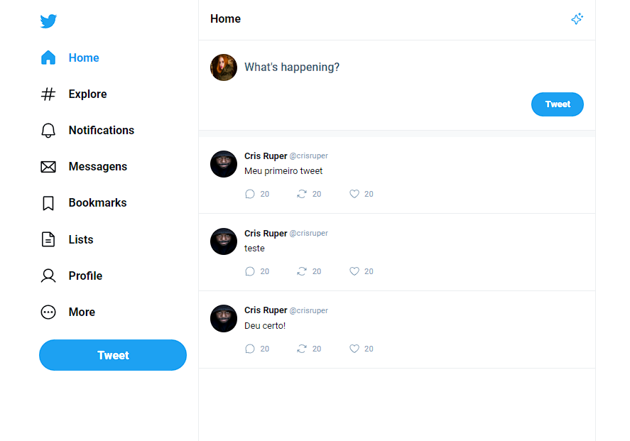

# Projeto Clone - Twitter Ui

## Feito o front utilizando React através do Vite com Typescript

## Bibliotecas utilizadas:

- Phosphor ( para icones )
- React Router Dom ( para pode trabalhar com SPA e Routes)

### Feito de forma Clean Code

### Utilizando responsividade

### Podendo postar um tweet, e vizualizar status do tweet.

### Em breve segue mais atualizações!

